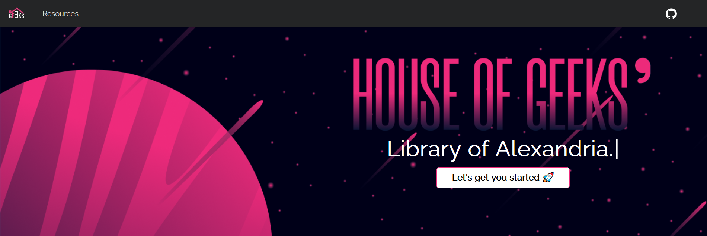

# Resource Library @hG

This is a collection of the various resources that we believe are ample for one to start in the various fields.

## Navigation

Access the docs via the `Let's get you started` button, or via the Resources section of the Nav.

## Contribution

Please go through the `CONTRIBUTING.md` file to familiarise with the process of managing git and versions for this repo. If you are willing to see a resource on the site, create an issue so that the quality of the resource could be verified.

You can also check the following doc to see if there are any links staged to be added:

[Buffer Doc](https://docs.google.com/document/d/1aC06zjRTflvcY4aDnRet8EGXr-qMuJFJ2Xx4WdgfTzQ/edit?usp=sharing)
